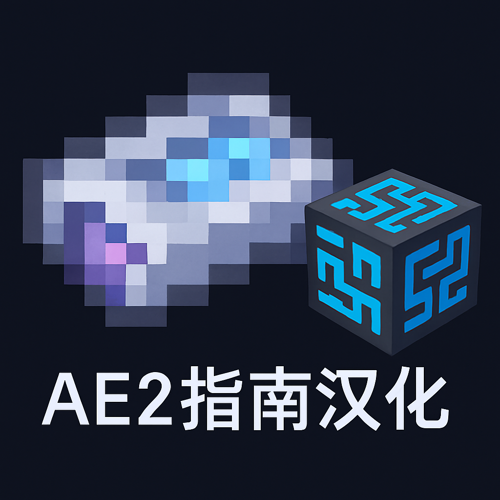
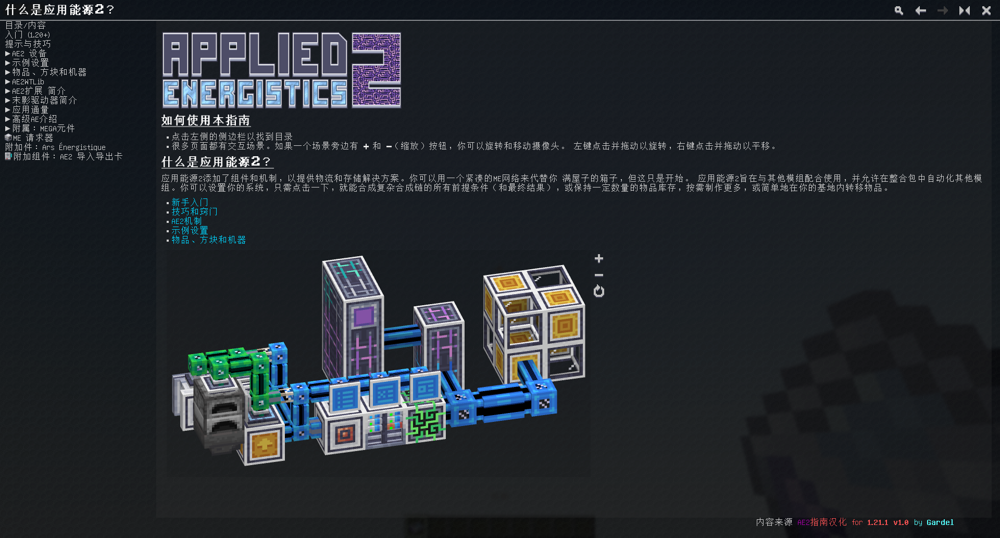
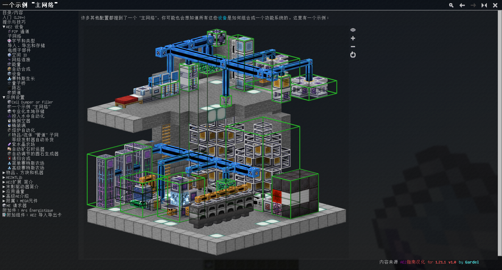

<h3 id="custom_h1">
  AE2 1.21.1 Guide 中文汉化
</h3>
   

 

本仓库提供了适用于《我的世界》1.21.1版本的应用能源2 (Applied Energistics 2) 指南的中文汉化资源包。通过此资源包，玩家可以在游戏中以中文查看应用能源2的相关指南内容。

---
## 预览图

## 特性
- **基于大语言模型汉化**：汉化内容可能有误，若有疑问请提交[Issue](https://github.com/mium-magic-server/AE2-1.21.1-Guide-zh_CN/issues/new)。
- **完全中文化**：所有指南内容均已翻译为简体中文。（除去包含内容的图片，汉化图片是项艰难的工作）
- **资源包形式**：无需额外安装模组，无需对模组jar包进行任何修改，只需将资源包放入游戏目录即可使用。

## 使用方法
1. 下载本仓库中的[资源包文件.zip](https://github.com/mium-magic-server/AE2-1.21.1-Guide-zh_CN/releases/latest)。
2. 将资源包文件放入游戏目录下的 `resourcepacks` 文件夹中。
3. 启动游戏并在资源包设置中启用该资源包。
4. 进入游戏后即可查看中文 `应用能源2` 的指南。

## 适用版本（经测试的）
- Minecraft 1.21.1
- NeoForge 21.1.209
- \[应用能源2\]appliedenergistics2-neoforge-19.2.16 **以上**

> [!Tip]
> 同时支持汉化很多附属/拓展模组

## 注意事项
- 本资源包仅适用于应用能源2模组的指南内容汉化，需确保已安装对应版本的应用能源2模组。
- 如果在使用过程中发现翻译问题或其他问题，欢迎提交 [Issue](https://github.com/mium-magic-server/AE2-1.21.1-Guide-zh_CN/issues/new)。

## 版权声明
本资源包遵循 [MIT 开源协议](https://opensource.org/licenses/MIT) 发布，可自由使用、分发。与应用能源2官方以及任何汉化作者无关。应用能源2模组的版权归其原作者所有。

感谢您的使用，祝您游戏愉快！

